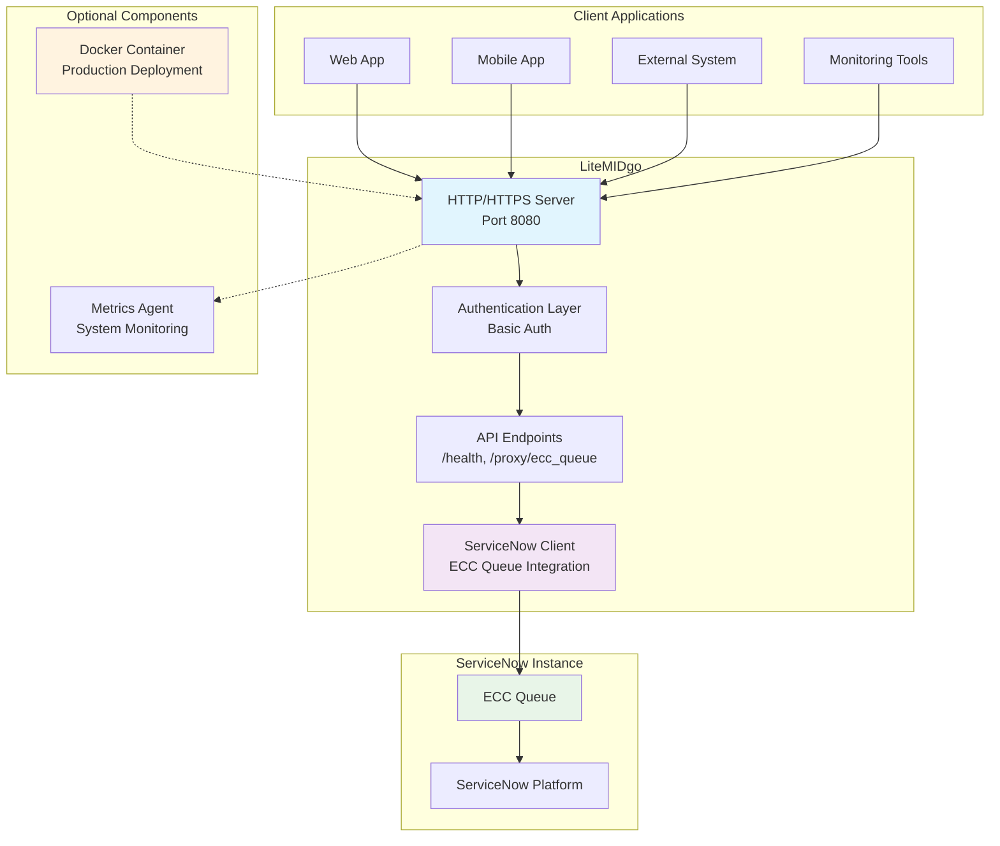
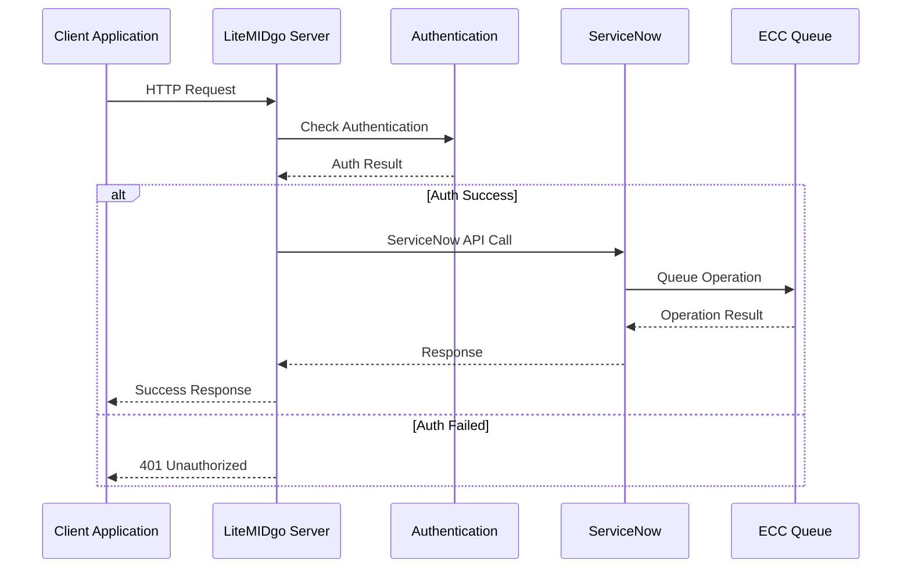
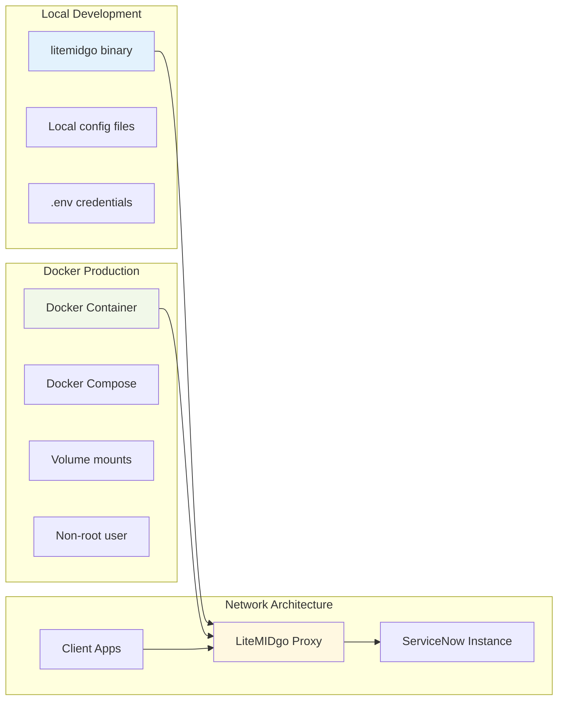

# LiteMIDgo

A lightweight middleware that acts as a web server proxy to ServiceNow instances, similar to ServiceNow's MID server but simpler and more focused on ECC queue operations.

## Features

- 🚀 **Lightweight**: Minimal resource footprint compared to full MID servers
- 🌐 **Web Server**: HTTP/HTTPS server with REST API endpoints
- 🔗 **ServiceNow Integration**: Direct communication with ServiceNow ECC Queue
- ⚙️ **Configurable**: YAML-based configuration with CLI setup
- 🛡️ **Secure**: Basic authentication and HTTPS support
- 📊 **Health Monitoring**: Built-in health checks and connection testing
- 🔄 **Graceful Shutdown**: Proper signal handling for production deployment

## Architecture



### Data Flow



### Deployment Options



## Quick Start

Choose your preferred deployment method:

### Option 1: Local Development (Recommended for development)

```bash
# Clone the repository
git clone https://github.com/RaikaSurendra/liteMIDgo.git
cd liteMIDgo

# Set up environment variables
cp .env.example .env
# Edit .env with your ServiceNow credentials

# Build and start services
make quick-start

# Check status
make status

# View logs
make logs

# Stop services when done
make stop
```

### Option 2: Docker Deployment (Recommended for production)

```bash
# Clone the repository
git clone https://github.com/RaikaSurendra/liteMIDgo.git
cd liteMIDgo

# Set up environment variables
cp .env.docker .env
# Edit .env with your ServiceNow credentials

# Build and start containers
make docker-up

# Check container status
make docker-status

# View container logs
make docker-logs

# Stop containers when done
make docker-down
```

## Prerequisites

### For Local Development:
- Go 1.24+ installed
- Make command available
- Terminal/command line access

### For Docker Deployment:
- Docker installed and running
- Docker Compose available
- Make command available (optional, but recommended)

## Deployment Comparison

| Feature | Local Development | Docker Deployment |
|---------|-------------------|-------------------|
| **Use Case** | Development, testing, debugging | Production, staging, CI/CD |
| **Setup Time** | ~2 minutes | ~5 minutes |
| **Resource Usage** | Lower | Higher (container overhead) |
| **Portability** | System-specific | Cross-platform |
| **Isolation** | Shared system | Full container isolation |
| **Networking** | localhost:8080 | Internal Docker network |
| **Security** | User permissions | Non-root container user |
| **Logs** | Files in project directory | Docker volumes |
| **Health Checks** | Manual | Automatic container health checks |

## Configuration

Both deployment methods use the same configuration approach:

### 1. Environment Variables

Copy the appropriate template and update with your credentials:

**For Local Development:**
```bash
cp .env.example .env
```

**For Docker Deployment:**
```bash
cp .env.docker .env
```

Then edit `.env` with your ServiceNow credentials:
```bash
SERVICENOW_INSTANCE=your-instance.service-now.com
SERVICENOW_USERNAME=your-username
SERVICENOW_PASSWORD=your-password
```

### 2. Interactive Configuration (Optional)

```bash
# Local only
./litemidgo config

# Test connection
./litemidgo config test
```

This will guide you through setting up:
- ServiceNow instance URL
- Authentication credentials
- Server settings
- Server configuration
- Network settings

### 3. Test Connection

```bash
./litemidgo config test
```

### 4. Start the Server

```bash
./litemidgo server
```

The server will start on `http://localhost:8080` (or your configured host/port).

## API Endpoints

### Health Check
```bash
GET /health
```

Returns the health status of the service and ServiceNow connection.

### ECC Queue Proxy
```bash
POST /proxy/ecc_queue
Content-Type: application/json

{
  "agent": "litemidgo",
  "topic": "MIDServer", 
  "name": "default",
  "source": "client-ip",
  "payload": {
    "command": "your-command",
    "data": "your-data"
  }
}
```

### Server Information
```bash
GET /
```

Returns server information and available endpoints.

## Configuration

Configuration is managed through a YAML file (`config/config.yaml` by default):

```yaml
server:
  host: "0.0.0.0"
  port: 8080

servicenow:
  instance: "your-instance.service-now.com"
  username: "your-username"
  password: "your-password"
  use_https: true
  timeout: 30
```

### Configuration Locations

The application searches for configuration in this order:
1. Environment variables (take precedence)
2. `./config.yaml`
3. `./config/config.yaml`
4. `$HOME/.litemidgo/config.yaml`

### Environment Variables

You can configure ServiceNow credentials using environment variables. The application will automatically load them from a `.env` file if present, or you can set them directly in your shell.

**Option 1: Using .env file (recommended for development)**
```bash
# Copy the example file
cp .env.example .env

# Edit .env with your credentials
SERVICENOW_INSTANCE=your-instance.service-now.com
SERVICENOW_USERNAME=your-username
SERVICENOW_PASSWORD=your-password
```

**Option 2: Using shell environment variables (recommended for production)**
```bash
export SERVICENOW_INSTANCE="your-instance.service-now.com"
export SERVICENOW_USERNAME="your-username"
export SERVICENOW_PASSWORD="your-password"
```

Environment variables take precedence over config file settings and are more secure for production deployments. The `.env` file is automatically excluded from git via `.gitignore`.

## Running the Application

### Local Development Commands

```bash
# Build both server and agent
make build

# Start both services in background
make start

# Check if services are running
make status

# View service logs
make logs

# Stop services
make stop

# Restart services
make restart

# Clean up build artifacts
make clean
```

### Docker Deployment Commands

```bash
# Build Docker images
make docker-build

# Start services in containers
make docker-up

# Check container status
make docker-status

# View container logs
make docker-logs

# Stop containers
make docker-down

# Restart containers
make docker-restart

# Clean up Docker resources
make docker-clean
```

### Manual Commands (Without Makefile)

#### Local:
```bash
# Build and run server
go build -o litemidgo .
./litemidgo server-simple

# Build and run agent (in separate terminal)
cd agent
go build -o litemidgo-agent .
./litemidgo-agent daemon --interval 10
```

#### Docker:
```bash
# Build and run with Docker Compose
docker-compose build
docker-compose up -d

# View logs
docker-compose logs -f

# Stop services
docker-compose down
```

## Docker Architecture

- **litemidgo-server**: Main server container with ServiceNow integration
- **litemidgo-agent**: Metrics collection agent
- **Health checks**: Built-in health monitoring
- **Networking**: Internal Docker network for secure communication
- **Volumes**: Persistent log storage

## Use Cases

### 1. Network Isolation
Deploy LiteMIDgo on a machine that has internet access (port 443) while other machines in your network can only reach the LiteMIDgo server.

### 2. ServiceNow Integration
Send data to ServiceNow ECC Queue from applications that don't have direct ServiceNow access.

### 3. Development & Testing
Use local deployment for development and Docker for testing in isolated environments.

## API Endpoints

Once the server is running, these endpoints are available:

- **GET /health** - Health check endpoint
- **GET /** - Server information  
- **POST /proxy/ecc_queue** - Send data to ServiceNow ECC Queue

## Testing

```bash
# Test configuration and ServiceNow connection
make test-config

# Collect metrics once (local)
make collect

# Test with curl
curl -X POST http://localhost:8080/proxy/ecc_queue \
  -H "Content-Type: application/json" \
  -d '{
    "agent": "test-agent",
    "topic": "endpointData", 
    "name": "test-host",
    "source": "curl-test",
    "payload": {"test": "data"}
  }'
```

## Troubleshooting

### Common Issues

1. **Port 8080 already in use**
   - Local: `make stop` or kill processes using port 8080
   - Docker: `make docker-down` before starting

2. **ServiceNow connection failed**
   - Verify credentials in `.env` file
   - Check network connectivity to ServiceNow instance
   - Run `make test-config` to test connection

3. **Agent can't connect to server**
   - Local: Ensure server is running on localhost:8080
   - Docker: Check both containers are healthy with `make docker-status`

4. **Environment variables not loading**
   - Ensure `.env` file exists in project root
   - Check file permissions
   - Verify variable names match exactly

## License

This project is provided as-is for educational and development purposes.

## Contributing

Feel free to submit issues and enhancement requests!
